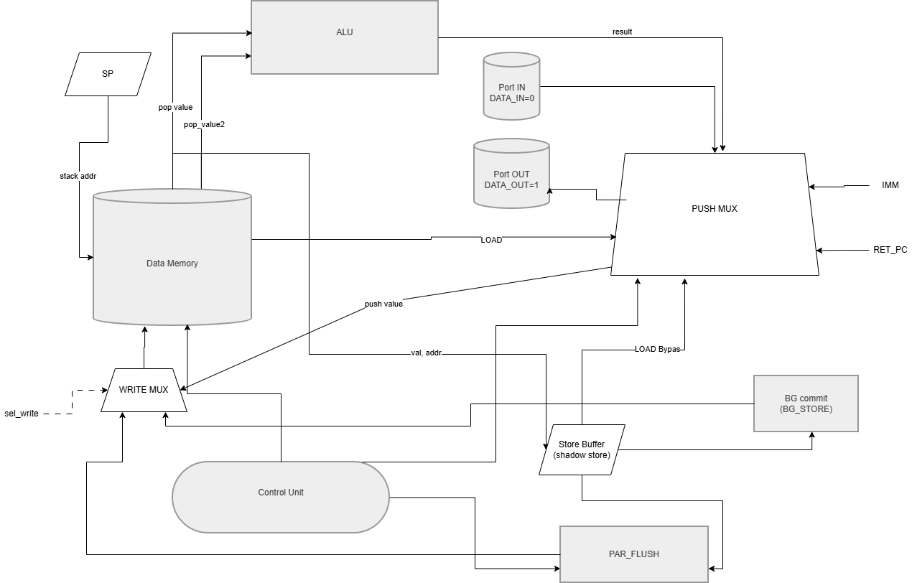

# Лабораторная работа №4: язык, транслятор, модель процессора

**ФИО:** Тарасов Владислав Павлович  
**Группа:** Р3219

Вариант:

```
lisp | stack | harv | hw | tick | binary | trap | port | pstr | prob1 | superscalar
```

[](https://github.com/byTheTV/ak-lab4/actions/workflows/ci.yml)

## Содержание

- [Язык программирования](#язык-программирования)
- [Организация памяти](#организация-памяти)
- [Система команд](#система-команд)
- [Транслятор](#транслятор)
- [Модель процессора](#модель-процессора)
- [Тестирование](#тестирование)

---

## Язык программирования

Подмножество Lisp-подобного синтаксиса: программа — одна или несколько форм подряд; комментарий от `;` до конца строки игнорируется.

### Синтаксис (форма Бэкуса-Наура)

```ebnf

program         ::= form+

form            ::= s-expr

s-expr          ::= integer
                  | string
                  | symbol
                  | "(" elements ")"

elements        ::= ε
                  | s-expr elements

integer         ::= ["+" | "-"] digit+
digit           ::= "0" | "1" | "2" | "3" | "4" | "5" | "6" | "7" | "8" | "9"

string          ::= '"' string-body '"'
string-body     ::= ε
                  | string-char string-body
string-char     ::= <любой символ, кроме неэкранированной " и конца файла>
                  | "\" "n"
                  | "\" any-char

symbol          ::= symbol-char+
symbol-char     ::= <любой символ, кроме пробела, TAB, CR, LF, "(", ")", "\"", ";">

defun-form      ::= "(" "defun" symbol "(" param-list ")" body+ ")"
param-list      ::= ε | symbol param-list
body            ::= s-expr

interrupt-form  ::= "(" "interrupt" integer body+ ")"

main-form       ::= s-expr

setq-form       ::= "(" "setq" symbol s-expr ")"
if-form         ::= "(" "if" s-expr s-expr s-expr ")"
progn-form      ::= "(" "progn" s-expr+ ")"

load-form       ::= "(" "load" s-expr ")"
store-form      ::= "(" "store" s-expr s-expr ")"

io-form         ::= "(" "in" ")"
                  | "(" "out" s-expr ")"

irq-ctl-form    ::= "(" "ei" ")"
                  | "(" "di" ")"

stack-form      ::= "(" "nop" ")"
                  | "(" "drop" ")"

cmp-form        ::= "(" cmp-op s-expr s-expr ")"
cmp-op          ::= "eq" | "=" | "<" | ">"

arith-form      ::= "(" arith-op s-expr s-expr arith-tail ")"
arith-tail      ::= ε | s-expr arith-tail
arith-op        ::= "+" | "-" | "*" | "/" | "mod"

call-form       ::= "(" symbol arg-list ")"
arg-list        ::= ε | s-expr arg-list

```

Содержимое строки (`string-char`): любой символ кроме `"` и незакрытого конца файла; `\n` превращается в перевод строки, для остальных `\x` в строку попадает символ `x` (см. `parse_string_literal` в [parser.py](src/ak_lab4/translator/parser.py)).

Содержимое символа (`symbol-char`): символ исходного текста, не входящий в множество разделителей — пробел, `\t`, `\r`, `\n`, `(`, `)`, `"`, `;` (см. [lexer.py](src/ak_lab4/translator/lexer.py)).

Комментарий: от `;` до конца строки удаляется на этапе лексического разбора (см. `tokenize` в [lexer.py](src/ak_lab4/translator/lexer.py)).

Список `(head arg ...)`: если `head` — символ из набора спецформ или имя `defun`-функции, действует соответствующее правило; иначе это вызов функции (ошибка компиляции, если имя не объявлено в предшествующих `defun`).

Пояснения к реализации:

- Пустой список `()` парсится, но **не** допускается как выражение в `codegen`.
- Пустой файл: `parse_many` → 0 форм; CLI транслятора — ошибка «файл пустой».
- `(progn e1 … en)`: между формами компилятор вставляет `DROP`, кроме хвоста после последней.
- `(if c t e)`: в IM присутствуют обе ветки; **выполняется** только выбранная (`JZ`).
- Арифметика: минимум два аргумента; лишние сворачиваются слева направо той же операцией.
- `(store addr val)`: на стек кладётся `addr`, затем `val` (вершина — значение); в машине `STORE` снимает сначала значение, затем адрес.
- Вызов `(f arg …)` допустим только для имён, объявленных в предшествующих `defun`.

### Спецформы и встроенные конструкции

| Конструкция | Назначение |
|-------------|------------|
| `(setq name expr)` | присвоение глобальной переменной |
| `(defun f (p ...) body...)` | функция; все `defun` должны идти до основного кода |
| `(progn e1 e2 ...)` | последовательное вычисление, значение — последнее |
| `(if cond then else)` | условие; ветки — выражения |
| `(load addr)` / `(store addr val)` | чтение/запись DM по адресу |
| `(in)` / `(out expr)` | порт ввода/вывода (см. ISA) |
| `(ei)` / `(di)` | разрешить / запретить маскируемые IRQ |
| `(interrupt n body)` | обработчик линии `n` (см. ниже); хвост программы после основного кода |
| Арифметика и сравнения | `+`, `-`, `*`, `/`, `mod`, `eq` или `=`, `<`, `>` (по реализации в [codegen.py](src/ak_lab4/translator/codegen.py)) |
| `(nop)`, `(drop)` | пустая операция / снять вершину стека (опкоды `NOP`/`DROP`) |

Строки: литерал `"..."` попадает в сегмент данных (pstr); при необходимости данных транслятор требует `--data-out`.

Ограничения текущего подмножества: отдельной спецформы `while` нет; итерации выражаются через рекурсивные `defun` + `if` (требование варианта `lisp`).

### Семантика

- Стратегия вычислений: eager — аргументы вычисляются до применения операции; в `if` в код попадают обе ветки, но при исполнении выполняется только выбранная (`JZ`).
- Области видимости: глобальные имена (`setq`) и параметры функций — фиксированные слоты в DM; вложенных `lambda` и замыканий нет. Сложные выражения и вызовы сворачиваются в последовательность операций со стеком и слотами DM.
- Типизация: фактически машинное слово 32 бита без тегов; для `PUSH_IMM` операнд — 24 бита со знаком (расширение до 32 бит при загрузке).
- Управление: `if`, рекурсивные вызовы `defun`, `CALL`/`RET` на уровне машины.

### Пример программы

```lisp
(progn
  (out 72)   ; H
  (out 105)  ; i
  (out 10))  ; newline
```

(фрагмент из [golden/hello/source.tv](golden/hello/source.tv))

---

## Организация памяти

### Модель процессора

Гарвард (harv): раздельные память команд IM и данных DM; слово 32 бита; порядок байт в бинарниках — little-endian (вариант `binary`).

| Память | Размер (слов) | Содержимое |
|--------|---------------|------------|
| IM | 65536 | код программы, векторы IRQ |
| DM | 65536 | стек, слоты setq, строки pstr, параметры |

Стек: растёт к увеличению адреса; база `STACK_BASE = 0x1000` ([memory.py](src/ak_lab4/memory.py)) — первая свободная ячейка под вершину (`sp` указывает следующую свободную ячейку над TOS).

Прерывания: в IM по адресу `1 + k` хранится слово-вектор для линии `k` (в модели ожидается инструкция `JMP` на обработчик). Старт с `PC = 0`.

### Сквозная раскладка

```text
       "Регистры" модели
+------------------------------+
| PC - счётчик команд (в IM)   |
| SP - указатель стека (в DM)  |
+------------------------------+

       Instruction memory (IM)
+------------------------------+
| 0   : старт программы        |
| 1   : вектор IRQ0 (jmp ...)  |
| 2   : вектор IRQ1            |
| ... : ...                    |
| n   : код пользователя       |
| ... : обработчики / defun    |
+------------------------------+

          Data memory (DM)
+------------------------------+
| 0 ... STACK_BASE-1 : данные, |
|                    литералы, |
|                    переменные|
| STACK_BASE ...     : стек    |
+------------------------------+
```

### Отображение при компиляции и исполнении

| Сущность | Где хранится | Как используется |
|----------|--------------|------------------|
| Малые целые | IM (`PUSH_IMM`) | непосредственная адресация в коде |
| Строки `pstr` | DM (длина + символы в словах) | адрес базы через слот/`PUSH_IMM` |
| `(setq name …)` | фиксированный слот в DM | `LOAD`/`STORE` по адресу слота |
| Параметры `defun` | слоты DM на функцию | тот же механизм |
| Процедуры | IM (`defun` + `CALL`/`RET`) | `CALL` кладёт `ret_pc` на стек |
| `(interrupt n …)` | отдельный участок IM | вектор `IM[1+n]` = `JMP` на handler |
| Операнды выражений | стек DM | все вычисления стековые |

Отдельных архитектурных регистров операндов нет: кроме `PC` и `SP` используется стек и слоты DM.

---

## Система команд

### Особенности

- Архитектура команд: стековая (stack), операнды на вершине и под ней.
- Данные: 32-битные слова, для сравнений и части арифметики — знаковая интерпретация (см. `SLT`, деление).
- Ввод-вывод: port-mapped (`IN`/`OUT` с номером порта в operand).
- Прерывания: `trap` через расписание JSON и флаги `EI`/`CLI` (см. модель).

### Кодирование инструкции

Одно машинное слово:

```text
 31 ----------- 24 23 --------------- 0
+------------------+-------------------+
|      opcode      |      operand      |
+------------------+-------------------+
```

opcode — старший байт (`Opcode` в [isa/__init__.py](src/ak_lab4/isa/__init__.py)), operand — 24 бита (адрес, немедленник, поле порта и т.д.).

### Набор команд и такты

Такты на полный цикл инструкции в **scalar** считаются функцией `scalar_ticks_for_opcode()` ([cpu.py](src/ak_lab4/cpu.py)): для большинства опкодов `1 + len(phases)` (один такт `FETCH`, затем по одной именованной фазе на такт). Исключение: `NOP`, `HALT`, `EI`, `CLI` — `FETCH` и `writeback` в **одном** такте (итого 1 тик).

Модель — потактовая: один вызов `Cpu.step()` = один такт. Строк `STALL` нет: ожидание выражается фазами `PHASE` (`execute`, `memory`, `mul`, `div`, `branch`, `writeback`). IRQ проверяется в начале каждого такта; незавершённая in-flight инструкция сохраняется в `suspended_user_pipeline` и восстанавливается после `RET` из ISR.

| Hex | Мнемоника | Такты (scalar) | Фазы после FETCH | Эффект на стеке (кратко) |
|-----|-----------|----------------|------------------|---------------------------|
| 00 | NOP | 1 | writeback* | без изменений |
| 01 | PUSH_IMM | 2 | writeback | push imm24 |
| 02 | DUP | 2 | writeback | dup TOS |
| 03 | DROP | 2 | writeback | pop |
| 04 | LOAD | 4 | execute, memory, writeback | pop addr -> push DM[addr] |
| 05 | STORE | 4 | execute, memory, writeback | pop val, pop addr -> DM[addr]=val |
| 06 | SWAP | 2 | writeback | поменять два верхних |
| 10 | ADD | 3 | execute, writeback | pop x, pop y -> push y+x |
| 11 | SUB | 3 | execute, writeback | pop x, pop y -> push y-x |
| 12 | MUL | 4 | execute, mul, writeback | знаковое умножение |
| 13 | DIV | 4 | execute, div, writeback | целочисленное деление |
| 14 | MOD | 4 | execute, div, writeback | остаток |
| 15 | EQ | 3 | execute, writeback | равенство -> 0/1 |
| 16 | SLT | 3 | execute, writeback | pop b, pop a -> push 1 если a<b (знаково) |
| 20 | JMP | 2 | writeback | PC <- адрес |
| 21 | JZ | 4 | execute, branch, writeback | pop c; ветвление по нулю |
| 22 | CALL | 3 | execute, writeback | push return; PC <- target |
| 23 | RET | 3 | execute, writeback | pop -> PC |
| 30 | IN | 3 | execute, writeback | push байт из порта |
| 31 | OUT | 3 | execute, writeback | pop -> порт |
| 32 | HALT | 1 | writeback* | останов |
| 33 | EI | 1 | writeback* | разрешить IRQ |
| 34 | CLI | 1 | writeback* | запретить IRQ |

\* `FETCH` и `writeback` в одном такте.

### Классификация

Система команд — стековая, формат команд фиксированный (одно слово); по соотношению «сложность операции / доступ к памяти» ближе к RISC-подобной модели с явными тактами на операцию, без микропрограммы (`hw`, не `mc`).

### Усложнение: superscalar

Требования ТЗ: не менее двух инструкций параллельно, зависимости по данным, видимость в журнале, влияние на производительность.

Реализация (паттерн deferred store / DLE / flush для stack из методички):

1. При `Cpu.superscalar=True` за один вызов `step` читается окно двух слов подряд из IM (`PC` и `PC+1`), и для безопасных пар возможна двойная выдача (`PAR`).
2. Для `STORE` — deferred store: запись сначала в `shadow_stores` (не более одной отложенной записи).
3. Для `LOAD` — dead load elimination: повторный `LOAD` того же адреса может взять `last_load_addr` / `last_load_value`.
4. При переполнении shadow — `PAR_FLUSH` (`reason=overflow`), затем новая запись в shadow.
5. Перед ISR и на `HALT` — принудительный flush shadow (`irq` / `halt`).
6. Один вызов `step` всегда добавляет 1 тик; при `PAR` обе инструкции завершают все фазы в этом такте.
7. В журнале: `PAR`, `PAR_FLUSH`, `BG_STORE`, `PAR_BLOCK`.

По умолчанию `superscalar=False`. Включение: `Cpu(superscalar=True)` или `--superscalar` у симулятора.

Производительность: сравнить `HALT ticks=...` на одном `code.bin` в scalar и superscalar (см. [tests/simulator/test_superscalar.py](tests/simulator/test_superscalar.py)).

---

## Транслятор

Модуль: `python -m ak_lab4.translator` ([cli.py](src/ak_lab4/translator/cli.py)).

### Интерфейс командной строки

| Аргумент / опция | Назначение |
|------------------|------------|
| `input` | файл с исходным текстом программы |
| `-o`, `--output` | путь к `code.bin` (по умолчанию `code.bin`) |
| `--data-out PATH` | `data.bin` — обязателен, если в программе есть строковые литералы |
| `--listing PATH` | текстовый дамп слов IM: `индекс - HEX` (см. [cli.py](src/ak_lab4/translator/cli.py)) |

Выход: бинарники слов little-endian; при ошибках — код возврата ≠ 0 и сообщение в stderr.

### Принципы работы (этапы)

1. Лексика + разбор: `tokenize` → `parse_many` — последовательность S-выражений ([lexer.py](src/ak_lab4/translator/lexer.py), [parser.py](src/ak_lab4/translator/parser.py)).
2. Семантика и кодогенерация: `compile_forms` — обход AST, раскладка `defun`, глобальных `setq`, строк, векторов прерываний; эмиссия слов IM/DM ([codegen.py](src/ak_lab4/translator/codegen.py)).
3. Ограничения: сначала все `(defun ...)`, затем основной код; при необходимости в конце — блоки `(interrupt n ...)` (см. BNF).

---

## Модель процессора

Модуль: `python -m ak_lab4.simulator` ([__main__.py](src/ak_lab4/simulator/__main__.py)).

Процессор разделён на **Control Unit** (такт, выборка, фазы, IRQ, PC) и **DataPath** (стек, DM, порты). В Python — классы `ControlUnit`, `DataPath`, состояние в `Cpu` ([cpu.py](src/ak_lab4/cpu.py)). Схемы отражают аппаратную структуру; подробное описание связей CU — в [sceme/README-ControlUnit.md](sceme/README-ControlUnit.md).

### Интерфейс командной строки

| Аргумент / опция | Назначение |
|------------------|------------|
| `code` | `code.bin` (IM) |
| `data` | `data.bin` (DM) |
| `--log PATH` | журнал исполнения (текстовый) |
| `--max-ticks N` | лимит тактов (по умолчанию 10^7) |
| `--input PATH\|-` | байты во входную очередь порта `DATA_IN`; `-` — stdin |
| `--schedule PATH` | JSON `{tick, irq, value}` для trap |
| `--superscalar` | двойная выдача + shadow store / DLE / flush |

Выход: при `HALT` — `HALT ticks=... PC=... SP=...`; байты `DATA_OUT` сравниваются с golden.

### Журнал

Колонки разделены табуляцией.

- Выборка: `ticks<TAB>FETCH<TAB>pc<TAB>word<TAB>USR|ISR`
- Фаза: `ticks<TAB>PHASE<TAB>phase_idx<TAB>phase_name<TAB>remaining<TAB>USR|ISR`
- Двойная выдача: `ticks<TAB>PAR<TAB>pc0<TAB>word0<TAB>pc1<TAB>word1<TAB>USR|ISR`
- Сброс shadow: `ticks<TAB>PAR_FLUSH<TAB>reason<TAB>addr:val ...<TAB>USR|ISR`
- Фоновый commit shadow: `ticks<TAB>BG_STORE<TAB>addr:val<TAB>USR|ISR`
- Блокировка PAR: `ticks<TAB>PAR_BLOCK<TAB>shadow_busy<TAB>USR|ISR`
- IRQ: `ticks<TAB>IRQ_TRAP<TAB>irq<TAB>ISR`

Вложенные IRQ при `interrupt_depth > 0` не доставляются; при trap сохраняется `suspended_user_pipeline`, на стек кладётся `ret_pc`, первый `IN` в ISR получает байт линии из trap (не из stdin).

### Trap (расписание IRQ)

Файл JSON — массив объектов с полями `tick` (номер шага симуляции, с нуля), `irq` (0…7), `value` (байт на линию). Разбор: [io_schedule.py](src/ak_lab4/io_schedule.py).

Пример:

```json
[
  {"tick": 10, "irq": 0, "value": 65}
]
```

### Схемы DataPath и ControlUnit

DataPath (PNG):



ControlUnit (PNG):


Управляющие сигналы CU → DP (пунктир на схеме): `signal_push`, `signal_pop`, `signal_peek_top`, `signal_read_mem`, `signal_write_mem`, `signal_read_port`, `signal_write_port`.

---

## Тестирование

Проверки: **качество + функциональность + регрессии**.

- **CI:** ruff (lint + format), mypy, pytest ([ci.yml](.github/workflows/ci.yml)).
- **Юнит/интеграция:** ISA, парсер, кодогенератор, CLI, CPU, IRQ, superscalar, потактовый pipeline.
- **Golden:** транслятор + симулятор, сверка `DATA_OUT` с эталоном ([golden_support.py](tests/golden_support.py), [test_golden_core_cases.py](tests/test_golden_core_cases.py)).

### Набор golden-кейсов

| Каталог | Назначение |
|---------|------------|
| hello | базовый вывод строки |
| cat | чтение из `DATA_IN` и вывод |
| hello_user_name | ввод имени и приветствие |
| sort | сортировка чисел (стек + DM) |
| pstr_two | строки pstr |
| double_math | 64-битная арифметика (два 32-битных слова) |
| prob1 | вариантный алгоритм (факторизация / Project Euler style, длинный прогон) |

В каталогах golden: `source.tv`, `expected_output.txt`, при необходимости `input.txt`. Машинный код и журнал для отчёта получают трансляцией и `--log` (в эталонах хранится прежде всего вывод порта).

### Покрытие кода

Прогон (Windows, Python 3.11): `pytest --cov=ak_lab4 --cov-report=term-missing:skip-covered` — **51** тест, все прошли. Сводка (файл `coverage-summary.md` генерируется тем же прогоном с `--cov-report=markdown:coverage-summary.md`, в git не коммитится):

| Модуль | Stmts | Miss | Cover |
|--------|------:|-----:|------:|
| `src/ak_lab4/cpu.py` | 569 | 84 | **83%** |
| `src/ak_lab4/translator/codegen.py` | 469 | 114 | **73%** |
| `src/ak_lab4/translator/lexer.py` | 102 | 3 | **95%** |
| `src/ak_lab4/translator/parser.py` | 97 | 14 | **82%** |
| `src/ak_lab4/translator/cli.py` | 49 | 21 | **56%** |
| `src/ak_lab4/io_schedule.py` | 40 | 11 | **68%** |
| `src/ak_lab4/loader.py` | 20 | 2 | **88%** |
| `src/ak_lab4/isa/__init__.py` | 42 | 0 | **100%** |
| `src/ak_lab4/memory.py` | 4 | 0 | **100%** |
| **Итого** | **1427** | **251** | **80%** |


### Пример использования

Пример фрагмента журнала (программа cat):


```text
1	FETCH	0	20000016	USR
2	PHASE	1	writeback	0	USR
3	FETCH	22	22000001	USR
4	PHASE	1	execute	1	USR
5	PHASE	2	writeback	0	USR
6	FETCH	1	01000000	USR
7	PHASE	1	writeback	0	USR
8	FETCH	2	30000000	USR
9	PHASE	1	execute	1	USR
10	PHASE	2	writeback	0	USR
11	FETCH	3	05000000	USR
12	PHASE	1	execute	2	USR
13	PHASE	2	memory	1	USR
14	PHASE	3	writeback	0	USR
…
```
