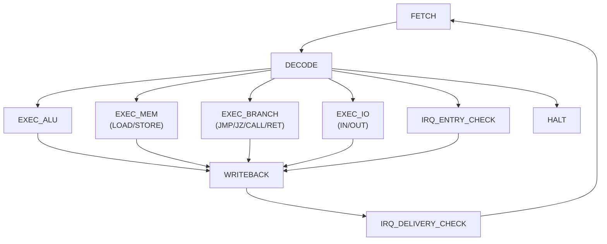

# ControlUnit (hw)

Схема отражает hardwired `ControlUnit` (вариант `hw | tick`), который выдаёт сигналы для `DataPath` по текущему `opcode`, состоянию стека и IRQ.

## Входы ControlUnit

- `opcode`, `operand` из `IR`.
- Сигналы состояния DataPath: `sp_empty`, `sp_overflow`, `tos_zero`.
- Сигналы подсистемы прерываний: `irq_pending[k]`, `irq_enabled`, `interrupt_depth`.
- Событие `max_ticks_reached` (для останова симуляции на уровне модели).

## Выходы ControlUnit

- Управление трактом команд: `pc_we`, `pc_sel`.
- Управление стеком и памятью данных: `sp_inc`, `sp_dec`, `dm_re`, `dm_we`, `wb_sel`.
- Управление АЛУ: `alu_op`.
- Управление портами: `in_en`, `out_en`, `port_sel`.
- Управление IRQ-переходом: `irq_ack`, `irq_vector_sel`, `irq_push_ret`.

## Логика обработки прерывания (trap)

1. После завершения инструкции выполняется `IRQ_DELIVERY_CHECK`.
2. Если `irq_enabled=1`, `interrupt_depth=0` и есть `irq_pending[k]`:
   - сохраняется `return PC` на стек;
   - `PC` загружается из вектора `IM[1 + k]`;
   - `interrupt_depth` увеличивается;
   - следующий цикл начинается в режиме ISR.
3. Возврат из ISR — по `RET` с декрементом `interrupt_depth`.

## Tick-точность

- Каждая инструкция моделируется как последовательность стадий автомата.
- Учёт тактов ведётся на полном цикле инструкции в соответствии с таблицей `_TICKS`.
- Для параллельной выдачи (режим `superscalar`) CU формирует объединённое событие `PAR` и отдельные события `PAR_FLUSH` при commit теневых store.
